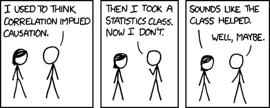

```{r}
#| include: false

library(ggplot2)
library(patchwork)

theme_set(
  theme_minimal(base_size = 18) +
    theme(
      panel.grid.major = element_line(color = "grey85"),
      panel.grid.minor = element_blank(),
      plot.title = element_text(face = "bold"),
      axis.title = element_text(face = "bold")
    )
)
```

# Korrelációelemzés

## Alapkérdés

::: r-fit-text
Összefügg-e két magas\
mérési szintű változó\
az alapsokaságban?
:::

## Példák

Összefügg

- a jövedelem az élettel való elégedettséggel?
- az életkor az intézmények iránti bizalommal?
- a sportolással töltött idő azzal, mennyire elégedett az egészségi állapotával?
- a közösségimédia-használat és a szorongás?
- elvégzett osztályok száma és az operalátogatás gyakorisága?

## Alaphelyzet (vs. kereszttábla)

-   független megfigyelések (ua.)
-   (egyszerű) véletlen minta (ua.)
-   két magas mérési szintű (intervallum-, vagy arányskála) változó (ker.táb: alacsony m.sz.)
-   *később*: ordinális (és nem normális eloszlású skála) változók közötti összefüggés
-   korreláció $=$ az asszociáció egy formája

## Cél

- annak felismerése, mikor alkalmas módszer a Pearson-féle korreláció
- pontdiagramok (*scatter plot*) értelmezése
- az $r$ mutató előjelének és nagyságának értelmezése
- korreláció és oksági kapcsolat megkülönböztetése
- mintából becsült és sokasági korreláció megkülönböztetése
- hipotézis felállítása és megvizsgálása a sokasági korrelációra

## Példa: adatok {.smaller}

| Diák | Tanulásra fordított órák / hét ($X$) | Vizsgapontszám ($Y$) |
|---:|---:|---:|
| 1 | 3 | 48 |
| 2 | 5 | 55 |
| 3 | 7 | 61 |
| 4 | 9 | 63 |
| 5 | 11 | 72 |
| 6 | 13 | 74 |
| 7 | 15 | 83 |

Minden sor egy hallgató adatait tartalmazza

# Pontdiagramok

## Ábrázolás mindenekellőtt {.smaller}

Mielőtt nekiállnak becsülni a korrelációt, vizsgálják meg a kétváltozós kapcsolatot egy ábra segítségével!

. . .

A pontdiagram (*scatter plot*):

- egyik változó értékei a vízszintes (x) tengelyen
- másik változó értékei a függőleges (y) tengelyen
- minden megfigyelés egy pont a diagramon

. . .

Számítás előtt vizsgálják meg:

1. kapcsolat irányát
2. formáját: lineáris vagy görbe?
3. erejét: szorosan elhelyezkedő pontok vagy szórtan?
4. kiugró (főleg gyanús) esetek
5. kirajzolódó alcsoportok

## Példa: pontdiagram

```{r}
#| label: fig-study-score
#| fig-width: 10
#| fig-height: 6
#| fig-cap: "Pozitív, megközelítőleg lineáris kapcsolat: a többet tanulók jellemzően több pontot szereznek."
set.seed(12)
study <- c(2, 3, 4, 5, 5, 6, 7, 7, 8, 8, 9, 9, 10, 10, 11, 12, 12, 13, 14, 15, 16, 17, 18, 19)
score <- round(42 + 2.2 * study + rnorm(length(study), 0, 7))
study_score_df <- data.frame(
  study = study,
  score = score
)

ggplot(study_score_df, aes(x = study, y = score)) +
  geom_point(color = "#2166ac", size = 3) +
  geom_smooth(
    method = "lm",
    se = FALSE,
    color = "#b2182b",
    linewidth = 1.2
  ) +
  labs(
    title = "Tanulásra fordított idő és vizsgaeredmény",
    x = "Tanulásra fordított idő (óra) hetente",
    y = "Vizsgapontszám (0–100)"
  )
```

## A pontdiagram olvasása

Az előző ábra alapján:

> **Pozitív**, **közepesen erős**, és **megközelítőleg lineáris** kapcsolat van a hetente tanulásra fordított órák száma és a vizsgapontszám között. Azok a hallgatók, akik többet készülnek, jellemzően nagyobb pontszámra számíthatnak, bár az egyéni szintű szóródás nem elhanyagolható.

## A pontdiagram olvasása

A teljes értékelés tartalmazza:

- **Kontextus:** mit mérnek a változók
- **Irány:** pozitív vagy negatív
- **Alak:** lineáris, görbe, vagy nincs kivehető mintázat
- **Erő:** gyenge, közepes vagy erős (óvatosan)
- **Szokatlan dolgok:** kilógó értékek, csoportok, közök

## Kapcsolat iránya és ereje {.smaller}

```{r}
#| label: fig-directions
#| fig-width: 10
#| fig-height: 10
#| fig-cap: "Az r előjele az irányt, abszolút nagysága az erőt mutatja"
set.seed(21)
n <- 50
x <- rnorm(n, 100, 10)
y1 = 0.5*x
y2= x + rnorm(n, 0, 8.7)
y3 = x + rnorm(n, 0, 16.5)
y4 = x + rnorm(n, 0, 39.5) 
y5 = rnorm(n, 20, 5)
y6 = -x + rnorm(n, 0, 39.5)
y7 = -x + rnorm(n, 0, 16.5)
y8 = -x + rnorm(n, 0, 8.7)
y9 = -3*x
direction_df <- rbind(
  data.frame(x = x, y = y1, rel="r = 1"),
  data.frame(x = x, y = y2, rel="r = 0.75"),
  data.frame(x = x, y = y3, rel="r = 0.5"),
  data.frame(x = x, y = y4, rel="r = 0.25"),
  data.frame(x = x, y = y5, rel="r = 0"),
  data.frame(x = x, y = y6, rel="r = -0.25"),
  data.frame(x = x, y = y7, rel="r = -0.5"),
  data.frame(x = x, y = y8, rel="r = -0.75"),
  data.frame(x = x, y = y9, rel="r = -1")
)

ggplot(direction_df, aes(x = x, y = y)) +
  geom_point(color = "#2166ac", size = 2.5) +
  facet_wrap(
    ~ forcats::fct_inorder(rel), 
    nrow = 3,
    scales="free"
    ) +
  labs(
    x = "X",
    y = "Y"
  )
```

## Gyakorlás: korrelációk sorbarendezése

Rendezzék sorba az alábbi ábrákat a *legerősebb negatív* korrelációtól a *legerősebb pozitív* korrelációig.

```{r}
#| label: rank-correlation
#| fig-width: 11
#| fig-height: 7
#| fig-align: center

set.seed(29)
x <- 1:30
ys <- list(
  85 - 2.0*x + rnorm(30,0,6),
  55 + rnorm(30,0,12),
  35 + 1.2*x + rnorm(30,0,10),
  20 + 2.2*x + rnorm(30,0,4)
)[c(4, 2, 1, 3)]
titles <- c("A", "B", "C", "D")

ranking_df <- do.call(
  rbind,
  lapply(seq_along(ys), function(i) {
    data.frame(
      x = x,
      y = ys[[i]],
      plot = titles[i]
    )
  })
)

ggplot(ranking_df, aes(x = x, y = y)) +
  geom_point(color = "#2166ac", size = 2.5) +
  facet_wrap(~ plot, ncol = 2) +
  labs(
    x = "X",
    y = "Y"
  )
```

## Kapcsolat iránya és ereje

- **Pozitív:** nagyobb x érték &rarr; nagyobb y érték
- **Negatív:** nagyobb x érték &rarr; kisebb y érték
- **Nulla közeli:** kevés vagy alig észrevehető lineáris kapcsolat

. . .

[Guess the Correlation!](https://guessthecorrelation.com/index.html)

## Összefüggés alakja

```{r}
#| label: fig-nonlinear
#| fig-width: 10
#| fig-height: 4.5
#| fig-cap: "Nemlineáris összefüggések"
set.seed(5)
x1 <- seq(-3, 3, length.out = 70)
y1 <- x1^2 + rnorm(70, 0, 0.45)

x2 <- runif(70, 0, 100)
y2 <- pmin(100, 5 + 1.5 * x2 - 0.0105 * x2^2 + rnorm(70, 0, 6))

nonlinear_df <- rbind(
  data.frame(
    x = x1,
    y = y1,
    relationship = "Strong curved relationship",
    x_label = "X",
    y_label = "Y"
  ),
  data.frame(
    x = x2,
    y = y2,
    relationship = "Curved / plateauing relationship",
    x_label = "Income (illustrative)",
    y_label = "Life satisfaction"
  )
)

plot_curved <- ggplot(
  subset(nonlinear_df, relationship == "Strong curved relationship"),
  aes(x = x, y = y)
) +
  geom_point(color = "#2166ac", size = 2.5) +
  geom_smooth(
    method = "lm",
    se = FALSE,
    color = "#b2182b",
    linewidth = 1
  ) +
  labs(
    title = "Erős nemlineáris",
    x = "X",
    y = "Y"
  )

plot_plateau <- ggplot(
  subset(nonlinear_df, relationship == "Curved / plateauing relationship"),
  aes(x = x, y = y)
) +
  geom_point(color = "#2166ac", size = 2.5) +
  geom_smooth(
    method = "lm",
    se = FALSE,
    color = "#b2182b",
    linewidth = 1
  ) +
  labs(
    title = "Nemlineáris, ellaposodó",
    x = "Jövedelem",
    y = "Élettel való elégedettség"
  )

plot_curved + plot_plateau
```

A nulla-közeli $r$ csak a *lineáris* kapcsolat hiányát mutatja, más kapcsolat lehet.

## Kiugró értékek hatása

```{r}
#| label: fig-outliers
#| fig-width: 10
#| fig-height: 4.5
#| fig-cap: "Egyetlen kiugró érték hatása"
set.seed(42)

x <- rnorm(35, 10, 2)
y <- 10 + 2*x + rnorm(35, 0, 5)

outlier_df <- data.frame(
  study_hours = x,
  exam_score = y,
  case_type = "Original observations"
)

outlier_added_df <- rbind(
  data.frame(
    study_hours = x,
    exam_score = y,
    case_type = "Original observations"
  ),
  data.frame(
    study_hours = 27,
    exam_score = 15,
    case_type = "Outlier"
  )
)

plot_without_outlier <- ggplot(
  outlier_df,
  aes(x = study_hours, y = exam_score)
) +
  geom_point(color = "#2166ac", size = 2.5) +
  geom_smooth(
    method = "lm",
    se = FALSE,
    color = "#b2182b",
    linewidth = 1
  ) +
  labs(
    x = "Tanulásra fordított idő (óra) hetente",
    y = "Pontszám"
  )

plot_with_outlier <- ggplot(
  outlier_added_df,
  aes(x = study_hours, y = exam_score, color = case_type)
) +
  geom_point(size = 2.5) +
  geom_smooth(
    aes(group = 1),
    method = "lm",
    se = FALSE,
    color = "#b2182b",
    linewidth = 1
  ) +
  geom_text(
    data = subset(outlier_added_df, case_type == "Outlier"),
    aes(label = "kiugró érték"),
    hjust = 1.1,
    vjust = -0.5,
    color = "#d73027",
    size = 3.5,
    show.legend = FALSE
  ) +
  scale_color_manual(
    values = c(
      "Original observations" = "#2166ac",
      "Outlier" = "#d73027"
    )
  ) +
  labs(
    x = "Tanulásra fordított idő (óra) hetente",
    y = "Pontszám",
    color = NULL
  ) +
  guides(color="none")

plot_without_outlier + plot_with_outlier
```

## Kiugró értékek

Kérdések:

- Lehet, hogy csak adatbeviteli hiba?
- Valódi megfigyelés ugyanabból a sokaságból?
- Jelentős hatása van az $r$-re?
- Érdemes lehet a kihagyásával és ezzel az esettel együtt is lefuttatni az elemzést?

## Alcsoportok

```{r}
#| label: fig-groups
#| fig-width: 9
#| fig-height: 5
#| fig-cap: "Az összesített kapcsolat elfedi a csoportszintű különbségeket"
set.seed(99)
x_a <- rnorm(35, 7, 1.4)
y_a <- 45 + 3 * x_a + rnorm(35, 0, 4)

x_b <- rnorm(35, 14, 1.4)
y_b <- 25 + 3 * x_b + rnorm(35, 0, 4)

groups_df <- rbind(
  data.frame(
    study_hours = x_a,
    exam_score = y_a,
    group = "A"
  ),
  data.frame(
    study_hours = x_b,
    exam_score = y_b,
    group = "B"
  )
)

ggplot(groups_df, aes(x = study_hours, y = exam_score)) +
  geom_point(
    aes(color = group),
    size = 3
  ) +
  geom_smooth(
    method = "lm",
    formula = y ~ x,
    se = FALSE,
    color = "black",
    linewidth = 1,
    linetype = "dashed"
  ) +
  geom_smooth(
    aes(color = group),
    method = "lm",
    formula = y ~ x,
    se = FALSE,
    linewidth = 0.75,
    linetype = "dashed"
    ) +
  scale_color_manual(
    values = c(
      "A" = "#1b9e77",
      "B" = "#d95f02"
    )
  ) +
  labs(
    x = "Tanulásra fordított idő",
    y = "Vizsgapontszám",
    color = "Csoport"
  )
```

## Látványosabb példa


## Alcsoportok kezelése

Mielőtt levonják a végkövetkeztetést, kérdezzék meg:

- Vannak-e elkülönülő társadalmi csoportok az adataim között?
- Ezeken a csoportokon belül hasonló kapcsolatot látunk?
- Van-e valamilyen harmadik változó, ami hatással lehet?

. . .

Ezeket az eseteket később a többváltozós elemzés tudja megfelelően kezelni.

## Vigyázat: látszólagos korreláció

Két változó összefügg, ha mindkettő összefügg egy harmadikkal. Ez különösen gyakori eset, ha ez a harmadik változó az idő (pl. év). 

Példákért: [Tyler Vigen: Spurious Correlations](https://www.tylervigen.com/spurious-correlations)

Egy konkrét példa: [Vajfogyasztás és moziárak](https://www.tylervigen.com/spurious/correlation/1604_butter-consumption_correlates-with_ticket-prices-at-north-american-movie-theaters)

# Pearson-féle korreláció becslése

## Mikor alkalmas mutató a Pearson-féle korrelációs együttható?

- két magas szintű változó
- megközelítőleg lineáris kapcsolat
- nincsenek zavaró kiugró értékek
- független megfigyelések
- legjobb: normális eloszlású változók \
(&rarr; hipotézisvizsgálat)

## Alkalmas változók {.smaller}

A Pearson-féle korreláció skála mérési szintű változókkal működik legjobban

- Életkor
- Jövedelem (*de: ferdeség*)
- Elvégzett iskolai osztályok
- Heti munkaórák
- Standardizált skálák

. . .

Kérdéses esetek

- 4/5-értékű Likert-skálák
- Sokértékű skálák

. . .

Inkább Spearman-féle rangkorreláció (később)

## Kiszámítása

A lineáris korreláció standard mérőeszköze

Mintából az alábbi képlettel számítjuk:

$$
r=\frac{\operatorname{cov}(X,Y)}{s_X\ast s_Y}
$$

Ezzel egyenértékű az alábbi képlet:

$$
r = \frac{\sum_{i=1}^{n}(x_i-\bar{x})(y_i-\bar{y})}
{\sqrt{\sum_{i=1}^{n}(x_i-\bar{x})^2} \ast
\sqrt{\sum_{i=1}^{n}(y_i-\bar{y})^2}}.
$$

## Miért pozitív vagy negatív a korreláció?

```{r}
#| echo: false
#| fig-width: 10
#| fig-height: 5.5

students <- data.frame(
  study_hours = c(3, 4, 5, 6, 7, 8, 9, 10, 11, 12, 13, 14, 6, 11),
  exam_score  = c(48, 57, 54, 67, 60, 75, 65, 78, 72, 83, 76, 89, 87, 51)
)

x_bar <- mean(students$study_hours)
y_bar <- mean(students$exam_score)

students$cross_product <-
  (students$study_hours - x_bar) *
  (students$exam_score - y_bar)

students$contribution <- ifelse(
  students$cross_product >= 0,
  "Pozitív hatás",
  "Negatív hatás"
)

r_value <- cor(students$study_hours, students$exam_score)

ggplot(
  students,
  aes(x = study_hours, y = exam_score)
) +
  geom_vline(
    xintercept = x_bar,
    linetype = "dashed",
    colour = "grey35"
  ) +
  geom_hline(
    yintercept = y_bar,
    linetype = "dashed",
    colour = "grey35"
  ) +
  geom_point(
    aes(
      colour = contribution,
      size = abs(cross_product)
    ),
    alpha = 0.85
  ) +
  scale_colour_manual(
    values = c(
      "Pozitív hatás" = "#2166ac",
      "Negatív hatás" = "#d95f02"
    )
  ) +
  scale_size_continuous(
    range = c(2.5, 8),
    name = "|Eltérések szorzata|"
  ) +
  labs(
    title = "Mely megfigyelések növelik/csökkentik a korreláció értékét?",
    x = "Tanulásra fordított idő (óra)",
    y = "Pontszám",
    colour = NULL
  ) +
  theme(
    legend.position = "bottom"
  )
```

## Az $r$ együttható tulajdonságai {.smaller}

| Tulajdonság | Jelentés |
|---|---|
| $-1 \leq r \leq 1$ | Ezek közé az értékek közé esik |
| Előjele | A lineáris kapcsolat iránya |
| Abszolút értéke | A lineáris kapcsolat ereje |
| $r=1$ | Tökéletes pozitív lineáris kapcsolat |
| $r=-1$ | Tökéletes negatív lineáris kapcsolat |
| $r=0$ | Nincs lineáris kapcsolat (másfajta lehet) |
| Nincs mértékegysége | Mértékegység-váltás nincs rá hatással |
| Szimmetrikus | $r_{XY}=r_{YX}$ |

## Előjel és nagyság értékelése

| Eredmény | Megfelelő interpretáció |
|---|---|
| $r=+0.62$ | [Közepesen erős pozitív kapcsolat]{.fragment} |
| $r=-0.48$ | [Közepesen erős negatív kapcsolat]{.fragment} |
| $r=+0.08$ | [Gyenge pozitív kapcsolat]{.fragment} |
| $r=-0.91$ | [Nagyon erős negatív kapcsolat]{.fragment} |

. . .

::: {.callout-note}
## Figyelem
Nincsenek kőbe vésett határértékek a kapcsolat erősségének felméréséhez. Az interpretáció többé-kevésbé Önökre van bízva. Az értelmezéshez mindig nézzék meg a pontdiagrammot!
:::

## Gyakorlás: előjel és nagyság

Állítsák sorba az alábbi korrelációkat a leggyengébbtől a legerősebbig!

| Érték |
|---|
|$r=0.24$|
|$r=-0.31$|
|$r=0.04$|
|$r=0.72$|
|$r=-0.83$|

## Gyakorlás: előjel és nagyság

Állítsák sorba az alábbi korrelációkat a leggyengébbtől a legerősebbig!

| Érték | Sorrend |
|---|---|
|$r=0.24$|2|
|$r=-0.31$|3|
|$r=0.04$|1|
|$r=0.72$|4|
|$r=-0.83$|5|

## Példa: korreláció értelmezése

450 hallgatóval készített kutatás alapján:

$$
r_{\text{tanulás, ponteredmény}}=0.46
$$

. . .

Mennyit kaptunk volna, ha

- a tanulásra fordított időt percekben mértük volna? [&rarr; ugyanúgy $r_{t,p}=0.46$]{.fragment}
- a vizsgaeredményt százalékban mértük volna? [&rarr; ugyanúgy $r_{t,p}=0.46$]{.fragment}


## Példa: korreláció értelmezése {.smaller}

Jó értelmezés:

> A hetente tanulásra fordított idő és a vizsgapontszám között közepesen erős pozitív kapcsolatot mértünk a mintában. Azok a tanulók, akik több tanulással töltött időről számoltak be, jellemzően több pontot szereztek a vizsgán.

. . .

Mit **nem** jelent ez:

- Minden plusz óra, amit tanulásra fordítanak, ugyanannyi plusz ponthoz vezet (feltételezi, de nem bizonyítja)
- Mindenki, aki többet tanul, több pontra számíthat (nem determinizmus)
- Azért kaptak több pontot, mert többet tanultak (potenciális alternatív magyarázatok)
- A tanulásra fordított idő az *egyedüli* releváns magyarázó tényező
- A kapcsolat minden egyetemen, évfolyamon, szakon, stb. azonos

## Korreláció vs. okság {.smaller}

Tételezzük fel, hogy pozitívan korrelál a közösségimédia-használat és a szorongás.

A mérés minőségi problémáit kizárva is a magyarázat többféle lehet:

| Lehetséges összefüggés | Például |
|---|---|
| $X \rightarrow Y$ | A több használat növeli a szorongást |
| $Y \rightarrow X$ | A szorongóbb emberek többet használják |
| Harmadik változó ($Z$) | A társas kapcsolatok hiánya növeli mindkettőt |

## Korreláció vs. okság



Forrás: [xkcd](https://xkcd.com/552/)

# Hipotézisvizsgálatok

## Sokasági és mintabeli korreláció

| Mennyiség | Jelölés | Jelentés |
|---|-|------|
| Sokasági korreláció | $\rho$ (“ró”) | Ismeretlen lineáris asszociáió a sokaságban |
| Mintabeli korreláció | $r$ | Mintában megfigyelt lineáris asszociáció; $\rho$ becslése |

. . .

$$
\overline{x} \rightarrow \mu \qquad
p \rightarrow P(\xi=x_i) \qquad
s^* \rightarrow \sigma \qquad
r \rightarrow \rho
$$

. . .

Az $r$ értéke akkor is változik mintáról-mintára, ha a sokaságban nem változik az összefüggés.

## Leírás és következtetés {.smaller}

Hipotézisvizsgálat alapkérdése: a megfigyeléseink lehetnek-e a véletlen művei

Ebban az esetben: lehetséges-e úgy megfigyelni ekkora korrelációt egy mintában, ha a sokaságban függetlenek egymástól a változók?

Kétoldali próba hipotézisei:

$$
H_0: \rho=0 \\
H_1: \rho\ne0
$$

Egyoldali próba is lehetséges (ha előre így fogalmazzuk meg):

$$
H_1: \rho>0
\qquad\text{vagy}\qquad
H_1: \rho<0
$$

## Tesztstatisztika

$$
t = r\sqrt{\frac{n-2}{1-r^2}},
\qquad df=n-2.
$$
Feltétel: normális eloszlású változók

Értelmezéshez:

- lineáris kapcsolat erősségét méri
- függ $r$-től és $N$-től
- statisztikai szignifikancia nem ugyanaz, mint az érdemi összefüggés

## Becsült korreláció és mintanagyság

Tegyük fel, hogy $r=0.20$

| Mintanagyság | Kétoldali p-érték | Következtetés |
|---:|---:|---|
| $n=25$ | $p\approx .34$ | Gyenge érv $\rho=0$-val szemben |
| $n=500$ | $p<.001$ | Erős érv $\rho=0$-val szemben |

::: {.callout-warning}
## Jó gyakorlat
A kis p-érték mérsékelt korrelációnál is kijöhet, ha a minta nagy. Közöljék és értelmezzék az $r$ értékét, a hozzá tartozó $p$-értékkel együtt.
:::

## Becsült korreláció és mintanagyság

```{r}
alpha <- 0.05
r_values <- seq(0.1, 0.9, by = 0.1)
n_values <- 3:450

dat <- expand.grid(n = n_values, r = r_values)
dat$t_stat <- with(dat, r * sqrt((n - 2) / (1 - r^2)))
dat$p_value <- with(dat, 2 * pt(-abs(t_stat), df = n - 2))
dat$r_label <- factor(sprintf("r = %.1f", dat$r),
                      levels = sprintf("r = %.1f", r_values))

# The first integer sample size at which each fixed observed r has p < .05.
crossings <- do.call(rbind, lapply(split(dat, dat$r_label), function(d) {
  d[which(d$p_value < alpha)[1], c("n", "r", "p_value", "r_label")]
}))

p <- ggplot(dat, aes(x = n, y = p_value, colour = r_label)) +
  geom_line(linewidth = 0.85) +
  geom_hline(yintercept = alpha, linetype = "dashed",
             colour = "grey25", linewidth = 0.75) +
  geom_vline(data = crossings,
               aes(xintercept = n, colour = r_label),
               linetype = "dotted", linewidth = 0.75, alpha = 0.85) +
  scale_colour_viridis_d(option = "turbo", end = 0.9, name = "Becsült korreláció") +
  scale_x_continuous(breaks = seq(0, 450, by = 50), expand = expansion(mult = c(0, .01))) +
  scale_y_continuous(breaks = seq(0, 0.20, by = 0.025),
                     labels = function(x) sprintf("%.3f", x)) +
  coord_cartesian(xlim = c(3, 450), ylim = c(0, 0.20)) +
  labs(
    title = "Korreláció, mintanagyság és p-érték összefüggése",
    subtitle = "Kétoldali Pearson-féle korrelációs t-próba H0: rho = 0",
    x = "N",
    y = "Kétoldali p-érték",
    caption = "A függőleges vonalak a legkisebb egész n-t mutatják, amelynél p < 0.05"
  ) +
  theme_minimal(base_size = 14) +
  theme(panel.grid.minor = element_blank(),
        legend.position = "right",
        plot.title = element_text(face = "bold"))

print(p)
```

## Kiszámítás példa {.scrollable}

Egy $n=80$ hallgatói mintában:

$$
r_{\text{tanulás, pontszám}}=0.35
$$

**1: hipotézisek**

$$
H_0:\rho=0
\qquad\text{vs}\qquad
H_1:\rho\ne0.
$$

**2: tesztstatisztika**

$$
t=0.35\sqrt{\frac{80-2}{1-0.35^2}}
\approx3.30,
\qquad df=78.
$$

**3: eredmény**

$$
p\approx0.0015
$$

**4: következtetés**

Elvetjük $H_0$-t $\alpha=0.05$ szignifikanciaszint mellett. Az adatok pozitív lineáris sokasági korrelációra engednek következtetni.

## Eredmények közlése {.smaller}

Közöljék a kontextust, az irányát, nagyságát, bizonytalanságot.

Például:

> A tanulásra fordított heti idő pozitívan függött össze a vizsgaeredménnyel. ($n=80$, $r=0.35$, $df=78$, $p=0.002$). Azok a hallgatók, akik több készülésről számoltak be, várhatóan több pontot kaptak. Az összefüggés közepesen erős.

Még jobb, ha a becsült korreláció mellét konfidenciaintervallumot is meg tudnak adni:

> $r=0.35$, 95% CI $[0.14,0.52]$, $p=0.002$.

Ez azt is megmutatja, milyen értékek közé esik nagy megbízhatósággal a sokasági korreláció.

# Összefoglalás

## Korrelációelemzés menete {.smaller}

1. **Kutatási kérdés** két numerikus változó összefüggéséről
2. **Adatok vizsgálata**: mérési szint, pontdiagram, linearitás, csoportok, kiugró értékek, hiányzó értékek
3. **Próba kiválasztása**: megfelel-e a Pearson-féle korreláció?
4. **Kapcsolat leírása**: kontextus, irány, erősség, alak.
5. **$r$ kiszámítása és közlése**: optimális esetben konfidenciaintervallummal.
6. **Hipotézisvizsgálat: $H_0:\rho=0$**, ha valamilyen sokaságra akarunk következtetést levonni, és a feltételek teljesülnek.
7. **Korreláció és okság megkülönböztetése**: alternatívák számbavétele.

## Legfontosabb információk {.smaller}

- Pearson-féle $r$ a *lineáris* asszociáció erősségét méri két magas mérési szintű változó között.
- Az $r$ értéke $-1$ és $+1$ közé esik. Az előjel az irányát, $|r|$ pedig a nagyságát mutatja.
- Az $r$ értéke *szimmetrikus*, és *független a mértékegységektől*.
- A hipotézisvizsgálat általában a $H_0:\rho=0$ hipotézist vizsgálja.
- A statisztikai szignifikancia a becsült korreláció és a mintanagyság függvénye.
- A korreláció (is) együttjárást mér, nem pedig oksági kapcsolatot.
